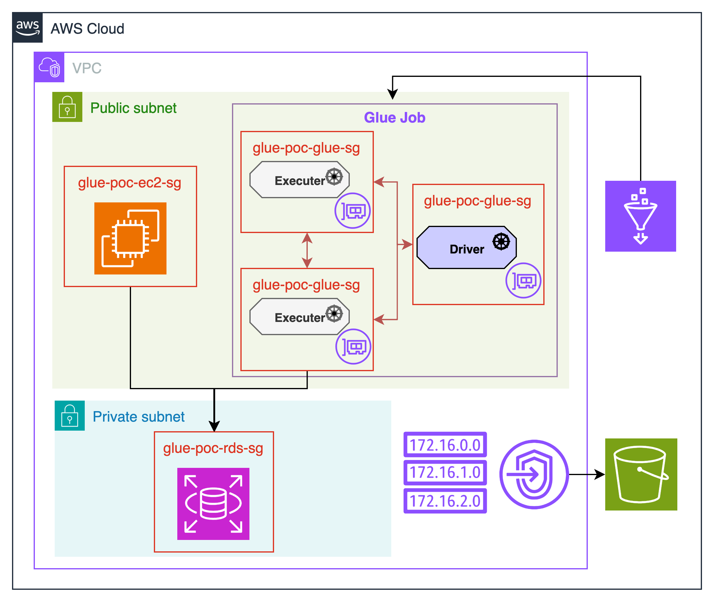

# glue_poc



This repository contains Terraform configurations for AWS Glue Proof of Concept with VPC access.

## Overview

This project demonstrates how to set up AWS Glue jobs within a VPC that can access RDS (MySQL) databases. It includes infrastructure configurations for VPC, subnets, security groups with self-referencing rules, RDS instances, and EC2 instances.

## Infrastructure Components

- **VPC**: Custom VPC with public and private subnets
- **EC2**: Instance in public subnet with Session Manager access
- **RDS**: MySQL instance in private subnet
- **Security Groups**: Self-referencing security group for Glue, security groups for EC2 and RDS
- **IAM Roles**: Necessary roles for EC2 Session Manager and Glue job execution

## Key Features

- **Self-referencing Security Group Pattern**: Implemented for AWS Glue to allow inter-node communication
- **Session Manager Access**: EC2 instance can be accessed without SSH port exposure
- **Database Connectivity**: Scripts for easy RDS connection from EC2
- **VPC Endpoints**: SSM endpoints for secure private subnet connectivity

## Getting Started

1. Clone this repository
2. Initialize Terraform:
   ```bash
   terraform init
   ```
3. Apply the configuration:
   ```bash
   terraform apply
   ```

## Connect to Resources

After deployment, you can:
- Connect to EC2 instance using Session Manager:
  ```bash
  aws ssm start-session --target $(terraform output -raw ec2_instance_id)
  ```
- From EC2, connect to RDS using the generated script:
  ```bash
  /home/ssm-user/connect_to_rds.sh
  ```

## Security Considerations

- EC2 instances use Session Manager, eliminating the need for inbound SSH rules
- RDS accepts connections only from the EC2 instance's security group
- Glue jobs use self-referencing security group for Spark cluster communication

## Notes on Self-referencing Security Groups

The self-referencing security group pattern is essential for AWS Glue because:

1. Glue uses Apache Spark which operates as a distributed system
2. Spark components (driver and executors) need to communicate with each other
3. This communication happens on dynamic ports
4. Executors may scale up and down, requiring automatic security group membership
